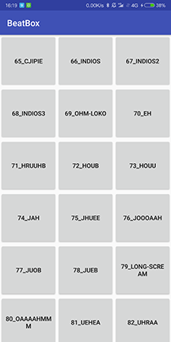

# BeatBox（Android 应用）

《Android 编程权威指南（第 3 版）》一个可以震慑坏人的应用，借此深入学习 fragment、媒体文件的播放与控制、MVVM 架构、数据绑定、单元测试、主题以及 drawable 资源
（Chapter 20 - Chapter 23）

## 应用截图

## 涉及技术

- （第 20 章）dataBinding， MVVM，assets 的使用
- （第 21 章）音频播放与单元测试
- //（第 22 章）
- //（第 23 章）